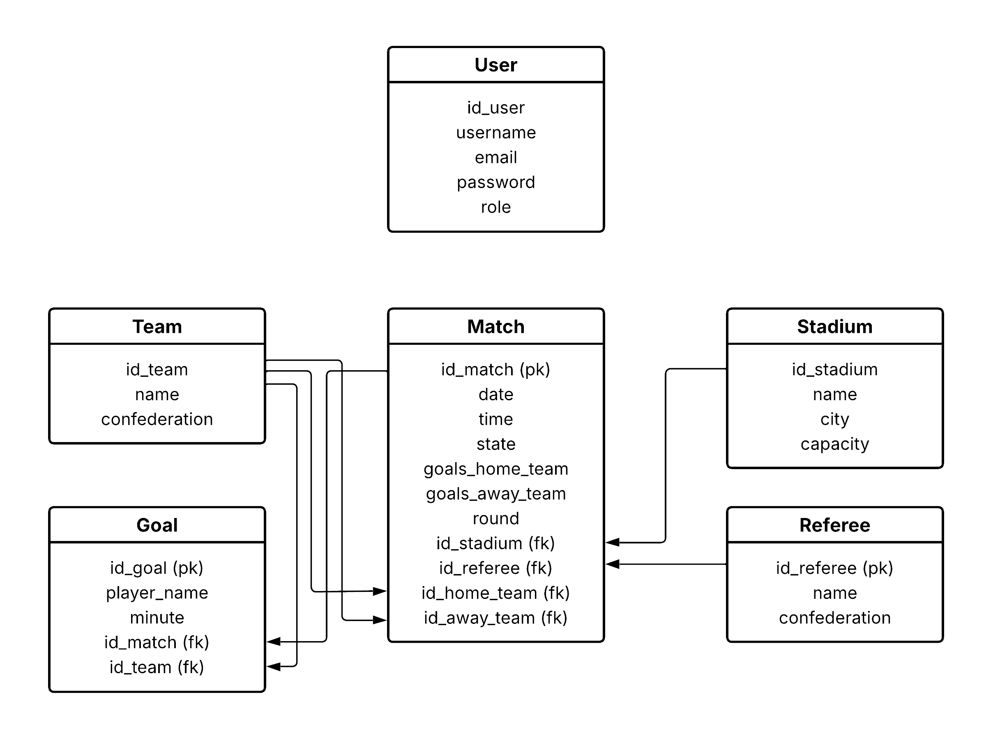

# Mundial de Fútbol 2026 - Módulo Partidos

## Descripción del Proyecto

Aplicación web integrada para la gestión del fixture de partidos del **Mundial de Fútbol 2026**. El sistema permite:

- **Autenticación y autorización** con JWT (roles: Admin y User)
- **Visualizar partidos** del torneo con información completa (equipos, estadio, árbitro, fecha)
- **Crear, editar y eliminar partidos** (solo Admin)
- **Rastrear goles** con información de quién marcó
- **Interfaz intuitiva** con Material UI

## Integrantes del Grupo
- Enzo Rojas
- Lautaro Videla
- Gustavo Vera
- Lautaro Videla

## Tecnologías Utilizadas

### Frontend
- **React** - Librería de UI
- **Material UI (MUI)** - Componentes y diseño
- **Vite** - Bundler de desarrollo rápido
- **Axios** - Cliente HTTP

### Backend
- **Python** - Lenguaje principal
- **Flask** - Framework web minimalista
- **SQLAlchemy** - ORM para bases de datos
- **MySQL** - Base de datos relacional

## Requisitos Previos
- **Python 3.10+**
- **Node.js 18+**
- **MySQL 8.0+**

## Instrucciones de Instalación

### 1. Clonar el Repositorio

```bash
git clone https://github.com/EnzoER16/App-web-Mundial-de-Futbol.git
cd app-web-mundial-de-futbol
```

### 2. Configurar el Backend

#### Crear entorno virtual
```bash
cd backend
python -m venv .venv
```

#### Activar el entorno virtual
- **Linux/Mac:**
  ```bash
  source venv/bin/activate
  ```
- **Windows (cmd):**
  ```bash
  venv\scripts\activate
  ```

#### Instalar dependencias
```bash
pip install -r requirements.txt
```

#### Crear base de datos
Abre MySQL y ejecuta:
```sql
CREATE DATABASE <nombre_base_de_datos>;
```

#### Configurar variables de entorno
```bash
cp .env.example .env
```

Edita `backend/.env` y configura:
```
MYSQL_USER=tu_usuario
MYSQL_PASSWORD=tu_contraseña
MYSQL_HOST=localhost_mysql
MYSQL_PORT=tu_puerto_mysql
DB_NAME=nombre_base_de_datos
JWT_SECRET_KEY=tu_clave_secreta
CORS_ORIGINS=localhost_react
```

#### Cargar datos iniciales
```bash
python seed.py
```

Esto crea:
- Usuario `admin` / `admin123` (rol Admin)
- Usuario `user` / `user123` (rol User)
- 48 equipos, 16 estadios, 15 árbitros
- Partidos de ejemplo

#### Iniciar servidor
```bash
python app.py
```

### 3. Configurar el Frontend

En **otra terminal nueva** (sin cerrar la del backend):

```bash
cd frontend
npm install
npm run dev
```

Abre `http://localhost:5173` en el navegador.

## Probar la Aplicación

1. **Regístrate** o inicia sesión con:
   - Admin: `admin` / `admin123` (permisos de edición)
   - User: `user` / `user123` (solo visualización)

2. **Explora el fixture** de partidos

3. **Como Admin:** Crea, edita o elimina partidos

4. **Cierra sesión** y prueba con otro usuario para ver diferencias de permisos

## Diagrama UML



## 📡 Documentación de API

### Base URL
```
http://localhost:5000/api
```

### Headers Requeridos
```json
{
  "Content-Type": "application/json",
  "Authorization": "Bearer <JWT_TOKEN>"
}
```

> El token JWT se obtiene en el login y debe incluirse en todas las peticiones protegidas.

### Endpoints Públicos (Sin Autenticación)

#### Registrarse
```http
POST /auth/register
```
**Body:**
```json
{
  "username": "nuevo_usuario",
  "password": "contraseña123"
}
```
**Respuesta (201):**
```json
{
  "id_user": "uuid-xxx",
  "username": "nuevo_usuario",
  "role": "User"
}
```

#### Iniciar Sesión
```http
POST /auth/login
```
**Body:**
```json
{
  "username": "admin",
  "password": "admin123"
}
```
**Respuesta (200):**
```json
{
  "access_token": "eyJ0eXAiOiJKV1QiLCJhbGc...",
  "user": {
    "id_user": "uuid-xxx",
    "username": "admin",
    "role": "Admin"
  }
}
```

### Endpoints Protegidos (Requieren Autenticación)

#### Obtener Todos los Partidos
```http
GET /matches
```
**Respuesta (200):**
```json
{
  "matches": [
    {
      "id_match": "uuid-xxx",
      "team_home": {
        "id_team": "uuid-xxx",
        "name": "Argentina",
        "flag_url": "flag_ar.svg"
      },
      "team_away": {
        "id_team": "uuid-yyy",
        "name": "Brasil",
        "flag_url": "flag_br.svg"
      },
      "stadium": {
        "id_stadium": "uuid-zzz",
        "name": "Estadio Azteca",
        "city": "México"
      },
      "referee": {
        "id_referee": "uuid-rrr",
        "name": "Pierluigi Collina"
      },
      "date": "2026-06-15T19:00:00Z",
      "status": "scheduled",
      "goals_home": 0,
      "goals_away": 0,
      "goals_scorers": []
    }
  ],
  "total": 48
}
```

#### Obtener Partido por ID
```http
GET /matches/{id_match}
```
**Respuesta (200):**
```json
{
  "id_match": "uuid-xxx",
  "team_home": { ... },
  "team_away": { ... },
  "stadium": { ... },
  "referee": { ... },
  "date": "2026-06-15T19:00:00Z",
  "status": "scheduled",
  "goals_home": 2,
  "goals_away": 1,
  "goals_scorers": [
    {
      "id_goal": "uuid-g1",
      "player_name": "Messi",
      "team": "home",
      "minute": 35
    },
    {
      "id_goal": "uuid-g2",
      "player_name": "Neymar",
      "team": "away",
      "minute": 67
    }
  ]
}
```

#### Crear Partido (Solo Admin)
```http
POST /matches
```
**Body:**
```json
{
  "id_team_home": "uuid-ar",
  "id_team_away": "uuid-br",
  "id_stadium": "uuid-stadium",
  "id_referee": "uuid-ref",
  "date": "2026-06-15T19:00:00Z",
  "status": "scheduled"
}
```
**Respuesta (201):**
```json
{
  "id_match": "uuid-nuevo",
  "team_home": { ... },
  "team_away": { ... },
  "message": "Match created successfully"
}
```
**Errores:**
- `400`: Datos incompletos o inválidos
- `403`: Solo Admin puede crear partidos

---

#### Actualizar Partido (Solo Admin)
```http
PUT /matches/{id_match}
```
**Body:**
```json
{
  "date": "2026-06-20T15:00:00Z",
  "status": "completed",
  "goals_home": 2,
  "goals_away": 1
}
```
**Respuesta (200):**
```json
{
  "id_match": "uuid-xxx",
  "message": "Match updated successfully"
}
```

#### Registrar Gol en un Partido (Solo Admin)
```http
POST /matches/{id_match}/goals
```
**Body:**
```json
{
  "player_name": "Messi",
  "team": "home",
  "minute": 35
}
```
**Respuesta (201):**
```json
{
  "id_goal": "uuid-goal",
  "player_name": "Messi",
  "team": "home",
  "minute": 35,
  "message": "Goal recorded successfully"
}
```

#### Eliminar Partido (Solo Admin)
```http
DELETE /matches/{id_match}
```
**Respuesta (200):**
```json
{
  "message": "Match deleted successfully"
}
```
**Errores:**
- `403`: Solo Admin puede eliminar
- `404`: Partido no encontrado

#### Cierre de Sesión
```http
POST /auth/logout
```
**Respuesta (200):**
```json
{
  "message": "Logged out successfully"
}
```